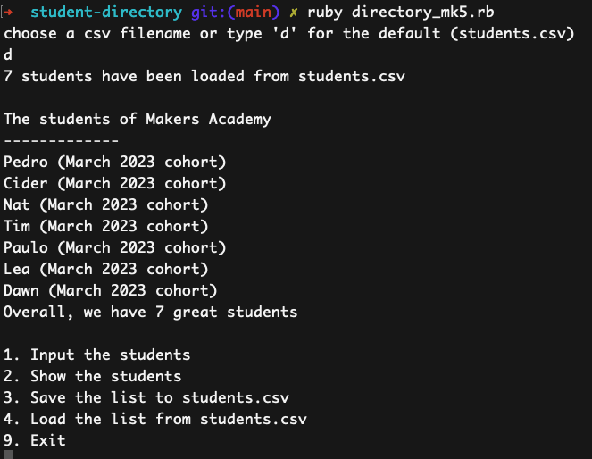

# student-directory

This is a Makers' PreCourse Week 4 project.

The student directory script allows users to manage the list of students enrolled in the Villains Academy.
It is a simple app appropriate to the stage of l;earning that we are at but of little interest now.

## How to use

```bash
ruby directory_mk5.rb
```
You will be prompted to enter a filename to open or choose `d` for the default file `students.csv`.



There six iterations of the app. The final version is `directory_mk5.rb`.

Other versions can be run using:
  
  ```bash
  ruby directory.rb
  ruby directory_mk1.rb
  ruby directory_mk2.rb
  ruby directory_mk3.rb
  ruby directory_mk4.rb
  ```
